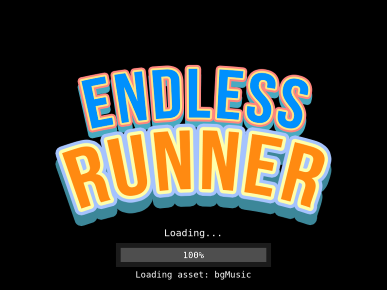
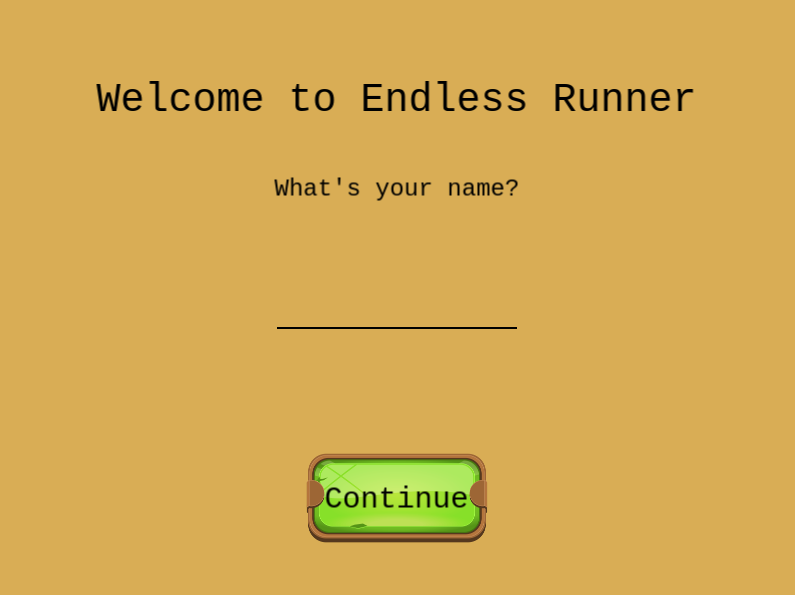
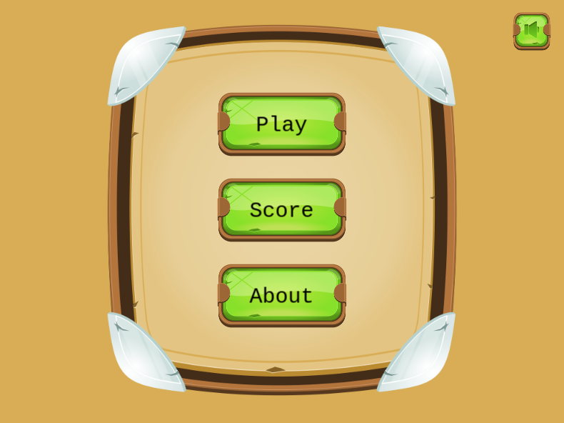
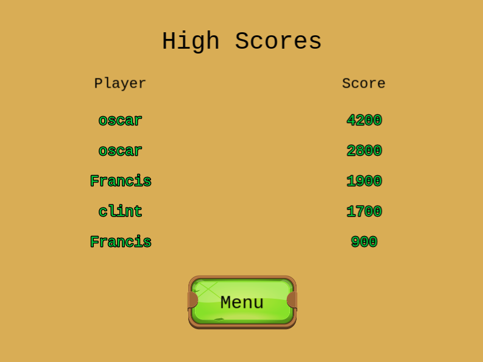
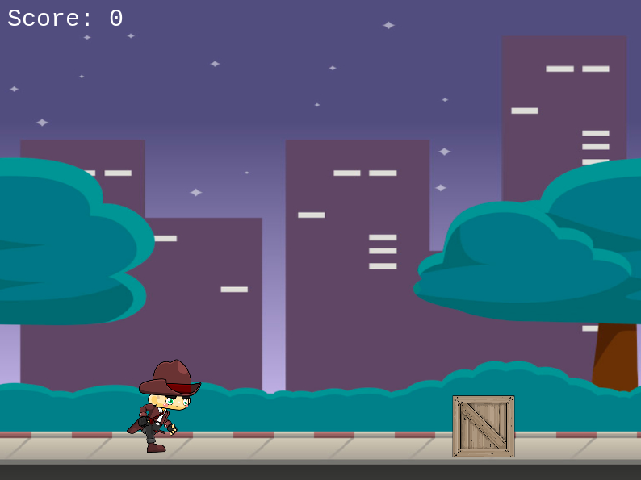
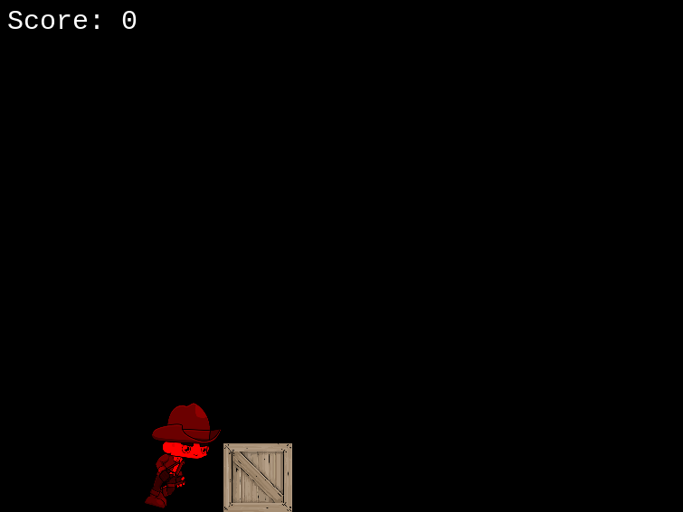
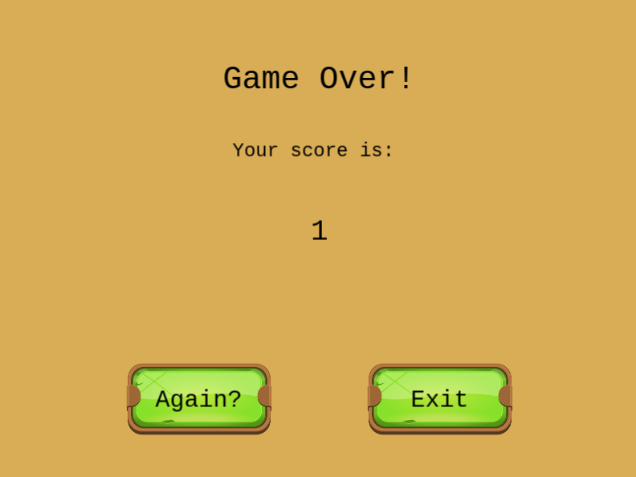
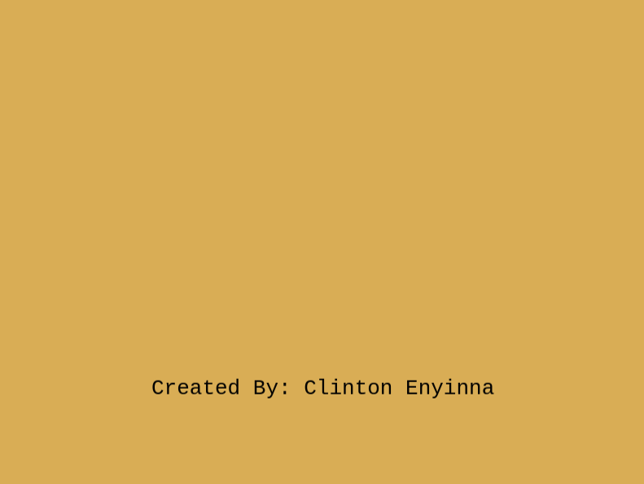

# javascript_game

[![Contributors][contributors-shield]][contributors-url]
[![Issues][issues-shield]][issues-url]
 

 
  <h2 align="center">Endless Runner</h2>
  

     
    <a href="https://github.com/ClintonEnyinna/endless_runner_game"><strong>Explore the docs »</strong></a>
     
     
    ·
    <a href="https://ClintonEnyinna/endless_runner_game/issues">Report Bug</a>
    ·
    <a href="https://github.com/ClintonEnyinna/endless_runner_game/issues">Request Feature</a>
  

<!-- TABLE OF CONTENTS -->

## Table of Contents

- [About the Project](#about-the-project)
  - [Built With](#built-with)
  - [Prerequisites](#prerequisites)
- [Credit](#credit)
- [Screenshots](#screenshots)
- [How To Play](#how-to-play)
- [Playing Locally](#playing-locally)
- [Testing](#testing)
- [Live Version](#live-version)
- [Future Improvements](#future-improvements)
- [License](#license)
- [Contact](#contact)

<!-- ABOUT THE PROJECT -->

## About The Project

This is an endless runner game where the player has to jump obstacles while running to stay alive. If the player collides with an obstacle the game is over. The game gets faster with time to increase its difficulty. There is a leadership board with players who have gotten the most points.

### Built With

This project was built with Phaser-3.js, a 2D game framework for making HTML5 games for desktop and mobile.

## Prerequisites

- Git
- NodeJs
- NPM
- Webpack
- Jest

## Screenshots

### Boot Scene

### Welcome Scene

### Title Scene

### ScoreBoard Scene

### Game Scene

### GameOver Scene

### Restart Scene

### Credit Scene

### How To Play

- Click or touch screen to jump up.
- You can jump twice by double clicking

## Playing Locally

Copy the following instructions sequentially into your terminal

- git clone https://github.com/ClintonEnyinna/endless_runner_game.git

- cd endless_runner_game

- Run `npm install`

- Run **_npm run start-dev_** in your terminal to fire the Webpack server

- Visit http://localhost:8080 on your browser.

## Testing

- cd endless_runner_game

- Run `npm install`

- Run `npm run test`to run the test suites

## Live Version

- You can view the app hosted online [here](https://laughing-poincare-3f2a23.netlify.app/).

<!-- FUTURE IMPROVEMENTS -->

## Future Improvements

See the [open issues](https://github.com/ClintonEnyinna/endless_runner_game/issues) for a list of proposed features (and known issues).

<!-- LICENSE -->

## License

Distributed under the MIT License. See `LICENSE` for more information.

<!-- CREDIT -->

## Credit

* [Phaser](https://phaser.io/)
* [OpenGameArt](https://opengameart.org/)
* [gameart2D](https://www.gameart2d.com/freebies.html)

<!-- CONTACT -->

## Contact

Clinton Enyinna - [Github profile](https://github.com/ClintonEnyinna)

Project Link: [Project repo](https://github.com/ClintonEnyinna/endless_runner_game)

<!-- MARKDOWN LINKS & IMAGES -->
<!-- https://www.markdownguide.org/basic-syntax/#reference-style-links -->

[contributors-shield]: https://img.shields.io/badge/Contributors-1-%2300ff00
[contributors-url]: https://github.com/ClintonEnyinna/endless_runner_game/graphs/contributors
[issues-shield]: https://img.shields.io/badge/issues-0-%2300ff00
[issues-url]: https://github.com/ClintonEnyinna/endless_runner_game/issues/
